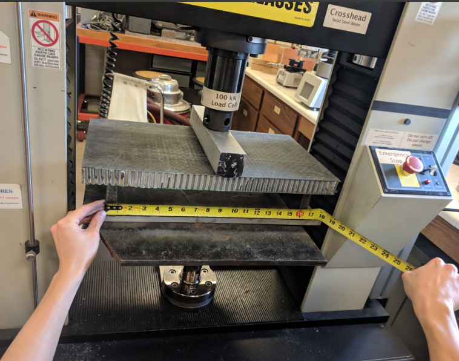

My senior year I led the complete redesign of our team's hybrid monocoque chassis (part spaceframe and part monocoque). The redesign centered around the monocoque section, with substantial changes from the previous year's design required for reasons of structural safety. The redesigned chassis needed to meet several structural baselines as predetermined by the Formula SAE committee. In addition, the previous year had received feedback on poor driver visibility and had several sections which disrupted smooth aerodynamics, limiting downstream aerodynamic performance.

The scope of our monocoque design space was limited by several hard constraints.
As is key with any composite structure, our design had to be a shape which could
be produced on a mold. In addition, the design was limited to composite
materials which were readily available to us. Each section of the
monocoque had to meet all criteria established by the Formula SAE rules
committee. Finally, the monocoque had to be able to withstand the full range of suspension loads it would see during driving.

Beyond these hard constraints, I set design constraints on driver
visibility, requiring that our shortest driver would be able to see at least 7
feet in front of the car.

With all of these constraints in place, I set about finding a design which
looked to minimize the weight of the monocoque while maintaining smooth airflow.
To maintain smooth airflow I coordinated with our aerodynamics subsystem to
model the airflow off the monocoque under a range of driving conditions. To
minimize the weight I coordinated several rounds of mechanical testing of
sandwich panels. These tests were driven by a mechanical properties tool which
used classical laminate theory to predict the properties of a sandwich panel
composite. This tool allowed us to find ideal starting points for the design of
each section of the car and then refine the design through mechanical testing to
derive the true properties of each sandwich panel. As such, we were able to
determine panel designs which met the structural requirements provided while
still finding a minimal areal density of each panel.

*Sandwich panel testing to derive material properties*

However, design work did not stop here. As previously mentioned, to manufacture
a composite structure we needed some form of mold, but our equipment was not
able to machine a mold of suitable size in-house. This left us the options of
either manufacturing the mold in parts and attempting to align the sections or
outsourcing the machining. Thanks to our wonderful sponsors at <a href =
"https://en.machinetools.camozzi.com/who/ingersoll-machine-tools.kl"> Ingersoll
Machine Tools </a> we were able to work alongside them to design molds which
could be machined on their large-scale CNC mills while meeting our critical
dimension requirements. This allowed for improved tolerance on the molds,
resulting in a higher quality finished monocoque. To make use of their machines
I had to collaborate with engineers working with our sponsor to ensure that our
molds were machineable.

After receiving the molds from our sponsor I worked with members of our
composite subsystem to make carbon-fiber tooling, which would be the final molds
for our monocoque. This was done so that the tools would match the coefficient
of thermal expansion between the tooling and the monocoque. With the carbon
tooling manufactured, our team handled five successive composite layups and cure
cycles in an on-campus autoclave.
